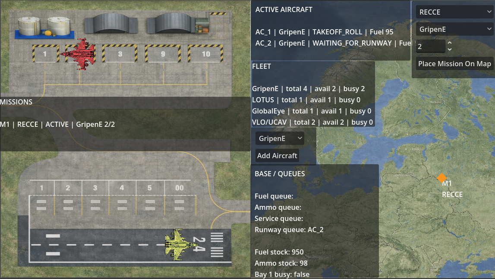

# AirbaseSim

AirbaseSim is a **2D airbase logistics and mission planning simulator** built using the **Godot Engine**.  
The simulator models aircraft operations at a military airbase, including fleet management, runway scheduling, mission deployment, and base logistics.

The goal of the project is to explore how operational constraints such as aircraft availability, runway access, fuel supply, and mission assignments influence airbase throughput and decision making.

---

# Simulator Overview

  

The screenshot above shows the main simulator interface.

The application is divided into two major operational views:

**Left side — Airbase Operations**

The left side of the simulator represents the physical airbase layout.  
This includes aircraft parking bays, hangars, service areas, taxiways, and the runway.

Aircraft move through different operational states while interacting with base infrastructure.  
For example, an aircraft may be:

- waiting for runway clearance
- taxiing toward the runway
- performing takeoff roll
- returning to base for service

Aircraft movement across the base provides a visual representation of the airbase logistics pipeline.

---

**Right side — Strategic Mission Map**

The right side displays a strategic map where missions can be assigned and tracked.

From this interface the user can:

- select a mission type (such as reconnaissance)
- choose the aircraft type assigned to the mission
- deploy missions on the map
- monitor mission locations and activity

Mission markers appear geographically on the map and represent operational tasks assigned to aircraft from the base fleet.

---

# Fleet Management

The simulator tracks the availability and status of each aircraft type.

Each fleet entry displays:

- total aircraft available at the base
- currently available aircraft
- aircraft currently busy with missions

Aircraft types currently represented in the simulator include:

- **Gripen E** – multirole fighter aircraft
- **LOTUS** – experimental concept aircraft
- **GlobalEye** – airborne early warning aircraft
- **VLO / UCAV** – stealth unmanned combat aircraft

This allows the simulator to model realistic aircraft availability constraints when planning missions.

---

# Base Logistics and Resource Queues

AirbaseSim models operational bottlenecks through several base logistics queues.

Examples include:

- fuel queue
- ammunition queue
- service queue
- runway queue

Aircraft must pass through these queues depending on their operational state.

For example, an aircraft may need to:

1. refuel
2. rearm
3. undergo service
4. wait for runway clearance

These constraints create realistic scheduling challenges when managing multiple aircraft simultaneously.

The simulator also tracks base resource stock levels such as fuel and ammunition, allowing users to observe how resource depletion affects operations.

---

# Active Aircraft Monitoring

The system tracks each active aircraft and displays its operational state in real time.

Information typically includes:

- aircraft identifier
- aircraft type
- current operational state
- remaining fuel

This allows users to quickly monitor aircraft activity and mission readiness.

---

# Technologies Used

AirbaseSim is built using:

- **Godot Engine**
- **GDScript**
- **2D simulation architecture**
- **GitHub Actions for automated builds**

---

# Running the Simulator

## Run using Godot

1. Install the Godot Engine
2. Clone this repository
3. Open the project in Godot
4. Run the project

## Prebuilt Executables

GitHub Actions automatically builds the simulator for supported platforms.

Build artifacts include:

- Windows executable
- macOS application bundle

These can be downloaded from the **GitHub Actions artifacts section** of the repository.

---

# Future Improvements

Possible future extensions include:

- aircraft maintenance modeling
- ground vehicle logistics (fuel trucks and service vehicles)
- mission success probability modeling
- AI-assisted mission planning
- multi-base coordination
- dynamic resource allocation

---

# License

This project is intended for demonstration and research purposes.